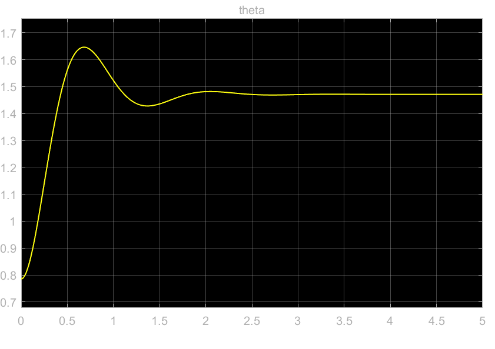

24773 Homework 1

Shaobo Wang

1.a

Assume $d(t)=n(t)\equiv 0$, system follows:

$$
\begin{cases}
Y(s)=G(s)U(s)\\
E(s)=R(s)-Y(s)\\
U(s)=C(s)E(s)-Q(s)[M(s)Y(s)-U(s)]
\end{cases}
$$
Since $G(s)$ is assumed to be invertible, transform the equations set into:

$$
\begin{cases}
G^{-1}(s)Y(s)=U(s)\\
[I-Q(s)]U(s)=C(s)E(s)-Q(s)M(s)Y(s)=C(s)R(s)-[C(s)+Q(s)M(s)]Y(s)
\end{cases}
$$
Eliminate $U(s)$:
$$
[I-Q(s)]G^{-1}(s)Y(s)=C(s)E(s)-Q(s)M(s)Y(s)=C(s)R(s)-[C(s)+Q(s)M(s)]Y(s)
$$
\[Answer]: Therefore the closed-loop transfer function $T$ is:
$$
T(s)\triangleq\frac{Y(s)}{R(s)}=\frac{C(s)}{G^{-1}(s)-Q(s)G^{-1}(s)+C(s)+Q(s)M(s)}
$$
\[Answer]: Therefore the sensitivity function $S$ is:
$$
S(s)\triangleq \frac{E(s)}{R(s)}=\frac{C(s)}{G^{-1}(s)-Q(s)G^{-1}(s)+Q(s)M(s)}
$$
1.b 

Assume $n(t)=r(t)\equiv 0$, system follows:
$$
\begin{cases}
Y(s) = G(s)[D(s)+U(s)]\\
U(s) = -C(s)Y(s)-Q(s)[M(s)Y(s)-U(s)]\\
\end{cases}
$$
Since $G(s)$ is assumed to be invertible, transform the equations set into:
$$
G^{-1}(s)Y(s)=D(s)+U(s)\\
[I-Q(s)]U(s)=[-C(s)-Q(s)M(s)]Y(s)
$$
Eliminate $U(s)$:
$$
[I-Q(s)]G^{-1}(s)Y(s)=[I-Q(s)]D(s)-[C(s)+Q(s)M(s)]Y(s)
$$
\[Answer]: Therefore the input sensitivity function $\frac{Y}{D}$ is:
$$
\frac{Y(s)}{D(s)} = \frac{I-Q(s)}{G^{-1}(s)-Q(s)G^{-1}(s)+C(s)+Q(s)M(s)}
$$
\[Answer]: When $Q(s)=I$ and $M=G(s)^{-1}$:
$$
\begin{cases}
\frac{Y(s)}{D(s)} = 0\\
\frac{Y(s)}{R(s)} = \frac{C(s)}{G^{-1}(s)+C(s)}=\frac{G(s)C(s)}{I+G(s)C(s)}
\end{cases}
$$
The effects of disturbances entering the plant input node are canceled since the input sensitivity function is always equal to zero, while the system acts as if there is only controller and plant in the feedforward loop of the entire closed-loop.

\[Answer]: The function of $Q(s)$ is to adjust the disturbance signal we are about to cancel. 

2.a

Assume state variables:
$$
x = 
\begin{bmatrix}
x_1\\
x_2
\end{bmatrix}
=\begin{bmatrix}
\dot \theta\\
\theta
\end{bmatrix}
$$
The State Space equation of the system is:
$$
\dot x =
\begin{bmatrix}
\dot x_1\\
\dot x_2
\end{bmatrix}
=\begin{bmatrix}
\ddot \theta\\
\dot\theta
\end{bmatrix}
=\begin{bmatrix}
-\frac{g}{l}\sin x_2+\frac{\tau}{ml^2}\\
x_1
\end{bmatrix}
$$
At equilibrium point $\theta = \frac{\pi}{2}$, find equilibrium point in state space:
$$
x_2 = \frac{\pi}{2},\ \exist \tilde\tau = mgl, s.t. \ddot\theta = 0\\
x_1 = 0
$$
\[Answer]: The linearized system about equilibrium point is:
$$
\begin{bmatrix}
\dot x_1\\
\dot x_2
\end{bmatrix}
= Ax+Bu
=\begin{bmatrix}
0&0\\
1&0
\end{bmatrix}
\begin{bmatrix}
x_1\\
x_2
\end{bmatrix}
+\begin{bmatrix}
\frac{1}{ml^2}\\
0
\end{bmatrix}\tau
$$
The eigenvalues of the $A$ matrix are both $0$, therefore defective. 

Assume $\theta$ as output, the transfer function's pole is $0$ which has no negative real part.

\[Answer]: The system in that configuration is not stable i.s.L and not BIBO stable.

2.b

The transfer function of the linearized pendulum system about the equilibrium point is:
$$
G(s) = \frac{1}{ml^2\cdot s^2}
$$
Assume the $m=1$ kg and $l=4$ m, $G(s) = \frac{1}{16s^2}$.

According to the nominal response, the natural frequency and damping factor are given by:
$$
\begin{cases}
\%overshoot = 25\% = \exp(\frac{-\xi\pi}{\sqrt{1-\xi^2}})\times 100\%\\
t_s = 2s = \frac{4}{\xi\omega_n}
\end{cases}
$$
 Solve for $\xi$ and $\omega_n$:
$$
\begin{cases}
\xi\omega_n = 2\\
\xi = 0.4037\\
\omega_n = 4.954
\end{cases}
$$

By introducing PD controller, the closed-loop system transfer function can be written as:
$$
\frac{K_p\frac{G(s)}{1+G(s)K_ds}}{1+K_p\frac{G(s)}{1+G(s)K_ds}}=\frac{K_pG(s)}{1+G(s)K_ds+K_pG(s)}=\frac{\frac{K_p}{ml^2}}{s^2+\frac{K_d}{ml^2}s+\frac{K_p}{ml^2}}
$$
In order to have the second-order system have the above response:
$$
\begin{cases}
\frac{K_d}{16} = 2\xi\omega_n = 4\\
\frac{K_p}{16} = {\omega_n}^2 = 24.54
\end{cases}
$$
\[Answer]: The designed gains for PD controller are:
$$
\begin{cases}
K_p = 392.67\\
K_d = 64
\end{cases}
$$
2.c

\[Answer]: Apply the designed PD controller. The initial condition response starting at rest from $\theta_0=45\degree$ is:

\[Answer]: The PD controller can stabilize the nonlinear system for an initial condition range from $[0,2\pi]$.

The Simulink model:

The Simulink pendulum subsystem:

3.a

The controllability matrix $P$ is:
$$
P = \begin{bmatrix}
B& AB
\end{bmatrix}=
\begin{bmatrix}
1&-1\\
1&-1
\end{bmatrix}
$$
The rank of $P$ is $1<2=n$.

The observability matrix $Q$ is:
$$
Q = \begin{bmatrix}
C\\CA
\end{bmatrix}=
\begin{bmatrix}
4&2\\
-4&-2
\end{bmatrix}
$$
The rank of $Q$ is $1<2=n$.

\[Answer]: Therefore the system is NOT controllable and NOT observable.

3.b

Since the state space equation is neither controllable nor observable, there exist redundant states. 

To find the minimum realization for the SISO system, first derive the transfer function $G(s)$:
$$
G(s) = C{(sI-A)}^{-1}B=
\frac{\begin{bmatrix}
4&2
\end{bmatrix}
\begin{bmatrix}
s+\frac{1}{2}&-\frac{1}{4}\\
-\frac{1}{2}&s+\frac{3}{4}
\end{bmatrix}
\begin{bmatrix}
1\\1
\end{bmatrix}}{(s+\frac{3}{4})(s+\frac{1}{2})-\frac{1}{8}}=
\frac{6s+\frac{3}{2}}{s^2+\frac{5}{4}+\frac{1}{4}}=\frac{6(s+\frac{1}{4})}{(s+1)(s+\frac{1}{4})}
$$
Eliminate the redundant state, $G(s) = \frac{6}{s+1}$.

Assume $G(s) = \frac{b_1s+b_0}{s+a_0}$, therefore $b_1=0$, $b_0=6$, $a_0=1$.

The controllable canonical form is:
$$
\dot x = 
-a_0x
+u
=-x
+u\\
y=
(b_0-b_1a_0)x
+b_1u
=6x
$$
Check the observability.

\[Answer]: The minimal realization is:
$$
\begin{cases}
\dot x = 
-x
+u\\
y=6x
\end{cases}
$$
To design a controller for this minimal realization that has a time constant of $0.001$ s,

Assume the gains of the designed controller gain is $K_p$

The closed-loop transfer function of this system is:
$$
H(s)=\frac{\frac{6K_p}{s+1}}{1+\frac{6K_p}{s+1}}=\frac{6K_p}{s+(6K_p+1)}
$$
The time constant $\tau$:
$$
\tau = \frac{1}{6K_p+1}=\frac{1}{1000}
$$
\[Answer]: The designed controller's gain is:
$$
K_p=166.5
$$

